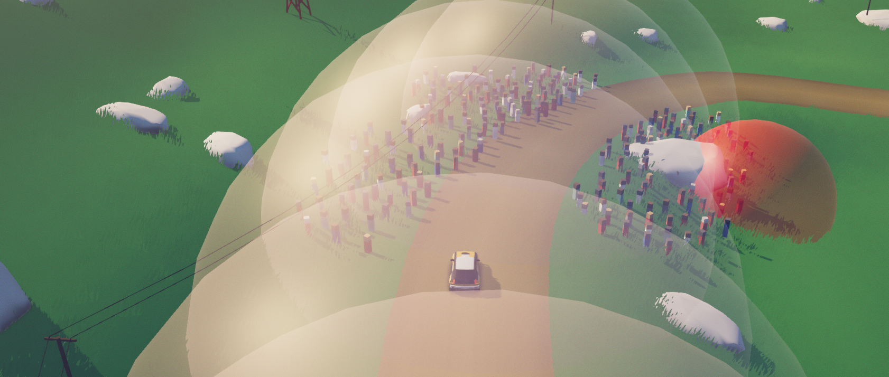

# Art Or™ Rally Reset Visualizer

A mod for Art Of Rally that visualizes waypoints and reset zones.

#### Launcher Support

#### Platform Support

## Usage

Press `CTRL + F10` to bring up the mod menu. Click on the Reset Visualizer mod,
and enable or disable the desired features.

## Installation

Follow the [installation guide](https://www.nexusmods.com/site/mods/21/) of
the Unity Mod Manager.

Then simply download the [latest release](https://github.com/Theaninova/Art-Of-Rally-Reset-Visualizer/releases/latest)
and drop it into the mod manager's mods page.

## Showcase

Demo Video:

